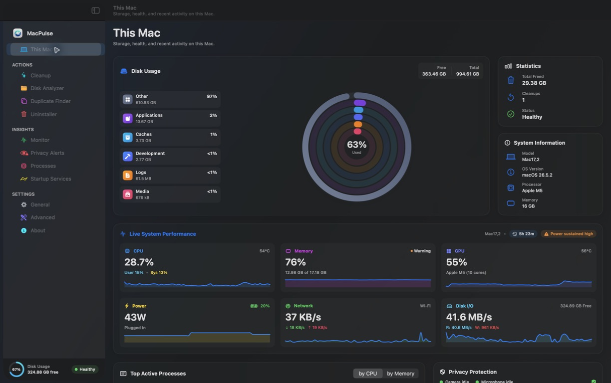
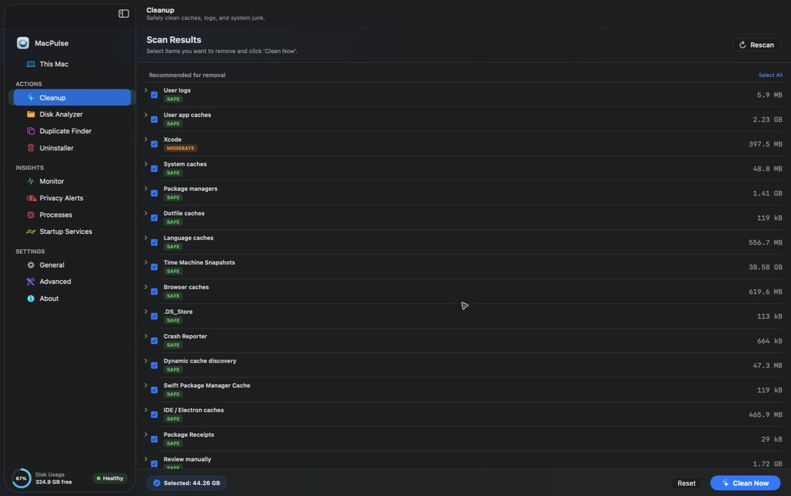
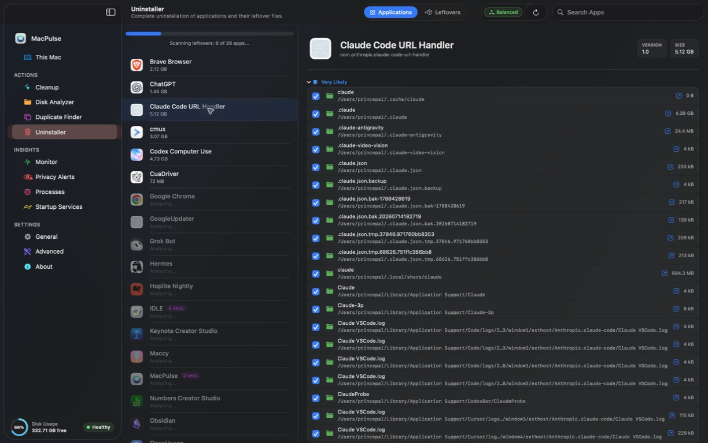
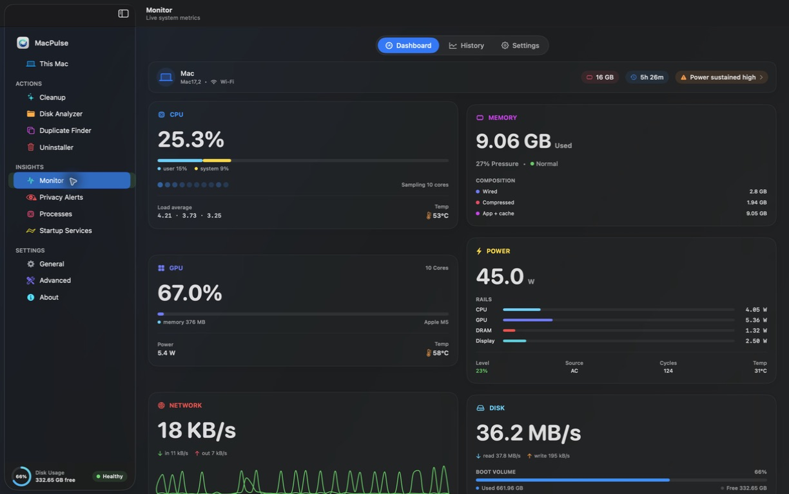
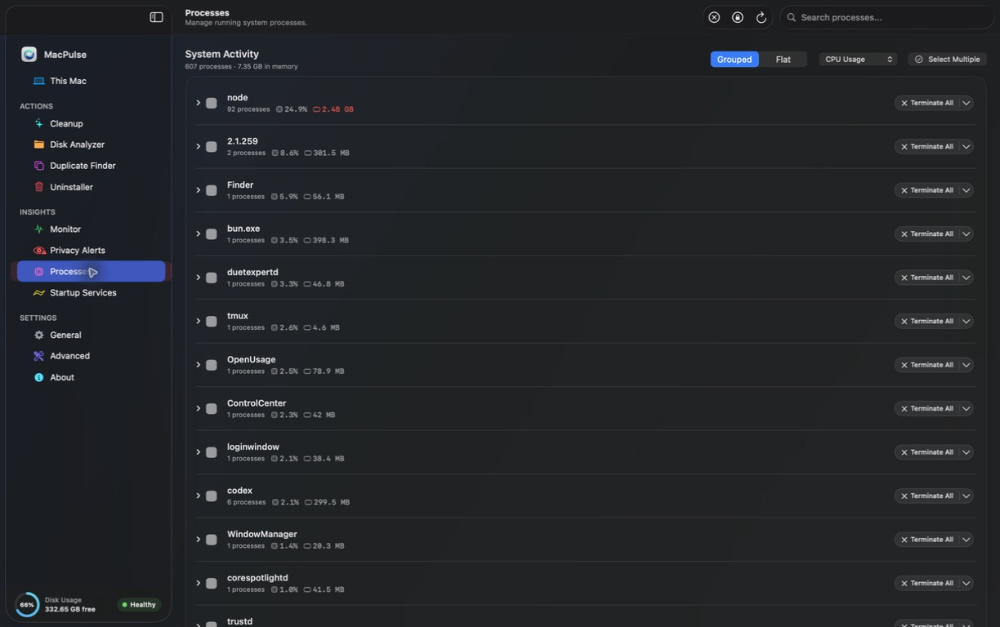

# MacPulse

The quiet, native Mac cleaner that leaves no trace.

MacPulse is a macOS system utility for deep cache cleaning, residual app
uninstallation, startup service inspection, APFS disk analysis, duplicate
finding, and live resource monitoring — built entirely in Swift & SwiftUI.

**Open source under the MIT license.** See [LICENSE](LICENSE).

<p align="center">
  
</p>

---

## Features

- **Deep Cleanup** — scan and clear application caches, logs, developer
  artifacts, and system junk with safety-gated, recoverable deletions.
- **Deep Uninstaller** — remove apps and the hidden leftovers they leave
  behind (preferences, caches, orphaned files), backed by a local snapshot
  journal for undo.
- **Disk Analyzer** — treemap, sunburst, and age-map visualizations of disk
  usage to find the heavy folders.
- **Duplicates Finder** — detect and remove duplicate files.
- **Process Monitor** — live overview of running processes, memory, and
  resource usage.
- **Startup Services** — inspect and manage login items, launch daemons, and
  background agents.
- **Safety by default** — pre-deletion snapshots, atomic journaling, and an
  evidence-based safety boundary keep your data protected.

### Feature Previews

<p align="center">
  
  
</p>
<p align="center">
  
  
</p>

---

## Requirements

- macOS 26.0 or later
- Full Disk Access is required for complete scan coverage

## Getting MacPulse

Download the latest `.dmg` from the
[Releases](https://github.com/princepal9120/MacPulse/releases/latest) page, or
build one locally with `scripts/release_dmg.sh`.

## Install (free / open source — no Apple fee)

Apple only skips Gatekeeper warnings for **paid** Developer ID + notarization
($99/year). MacPulse ships as unsigned OSS like many Mac open-source apps.

**One-liner (recommended):**

```sh
curl -fsSL https://raw.githubusercontent.com/princepal9120/MacPulse/main/scripts/install.sh | bash
```

**Or manual DMG:**

1. Download from [Releases](https://github.com/princepal9120/MacPulse/releases/latest)
2. Drag MacPulse → Applications (or `~/Applications`)
3. macOS will warn because the build is not notarized. Pick one:

```sh
# Option A — clear the download quarantine flag (fastest)
xattr -cr /Applications/MacPulse.app

# Option B — GUI: right-click the app → Open → Open, or
# System Settings → Privacy & Security → “Open Anyway”
```

> Builds older than v1.0.0 (2026-09-14) are *unsigned* rather than ad-hoc
> signed, so macOS reports “MacPulse is damaged” with no override. Re-download
> the DMG or use the installer one-liner above.

**Or build from source:**

```sh
git clone https://github.com/princepal9120/MacPulse.git
cd MacPulse
xcodebuild -project MacPulse/MacPulse.xcodeproj -scheme MacPulse -configuration Release build
```

## Build release DMG

```sh
./scripts/release_dmg.sh
```

Optional paid signing (not required for OSS): `./scripts/setup_signing.sh` then
re-run `./scripts/release_dmg.sh` if you later buy an Apple Developer membership.

## Rooms

- Pure Swift & SwiftUI
- Zero background daemons
- Zero telemetry
- Local, atomic pre-deletion snapshots

## License

MacPulse is released under the [MIT License](LICENSE). Contributions are
welcome; see [CONTRIBUTING.md](CONTRIBUTING.md).

## Author

Prince Pal
